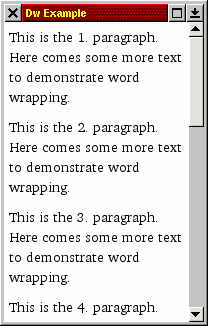

# Dillo Widget Usage

This document describes the usage of Dw, without going too much into
detail.

# Getting Started

In this section, a small runnable example is described, based on the
FLTK implementation.

As described in dw-overview, the following objects are needed:

* dw::core::Layout,
* an implementation of dw::core::Platform (we will use dw::fltk::FltkPlatform),
* at least one implementation of dw::core::View (dw::fltk::FltkViewport), and
* some widgets (for this example, only a simple dw::Textblock).

First of all, the necessary includes:

```
#include <FL/Fl_Window.H>
#include <FL/Fl.H>

#include "dw/core.hh"
#include "dw/fltkcore.hh"
#include "dw/fltkviewport.hh"
#include "dw/textblock.hh"
```

Everything is put into one function:

```
int main(int argc, char **argv)
{
```

As the first object, the platform is instantiated:

```
   dw::fltk::FltkPlatform *platform = new dw::fltk::FltkPlatform ();
```

Then, the layout is created, with the platform attached:

```
   dw::core::Layout *layout = new dw::core::Layout (platform);
```

For the view, we first need a FLTK window:

```
   Fl_Window *window = new Fl_Window(200, 300, "Dw Example");
   window->begin();
```

After this, we can create a viewport, and attach it to the layout:

```
   dw::fltk::FltkViewport *viewport =
      new dw::fltk::FltkViewport (0, 0, 200, 300);
   layout->attachView (viewport);
```

Each widget needs a style (`dw::core::style::Style`, see `dw::core::style`), so we construct it here. For this, we need to fill a `dw::core::style::StyleAttrs` structure with values, and call `dw::core::style::Style::create` (latter is done further below):

```
   dw::core::style::StyleAttrs styleAttrs;
   styleAttrs.initValues ();
   styleAttrs.margin.setVal (5);
```

`dw::core::style::StyleAttrs::initValues` sets several default values. The last line sets a margin of 5 pixels. Next, we need a font. Fonts are created in a similar way, first, the attributes are defined:

```
   dw::core::style::FontAttrs fontAttrs;
   fontAttrs.name = "Bitstream Charter";
   fontAttrs.size = 14;
   fontAttrs.weight = 400;
   fontAttrs.style = dw::core::style::FONT_STYLE_NORMAL;
   fontAttrs.letterSpacing = 0;
   fontAttrs.fontVariant = dw::core::style::FONT_VARIANT_NORMAL;
```

Now, the font can be created:

```
   styleAttrs.font = dw::core::style::Font::create (layout, &fontAttrs);
```

As the last attributes, the background and forground colors are defined, here `dw::core::style::Color::createSimple` must be called:

```
   styleAttrs.color =
      dw::core::style::Color::create (layout, 0x000000);
   styleAttrs.backgroundColor =
      dw::core::style::Color::create (layout, 0xffffff);
```

Finally, the style for the widget is created:

```
   dw::core::style::Style *widgetStyle =
      dw::core::style::Style::create (layout, &styleAttrs);
```

Now, we create a widget, assign a style to it, and set it as the
toplevel widget of the layout:

```
   dw::Textblock *textblock = new dw::Textblock (false);
   textblock->setStyle (widgetStyle);
   layout->setWidget (textblock);
```

The style is not needed anymore (a reference is added in `dw::core::Widget::setStyle`), so it should be unreferred:

```
   widgetStyle->unref();
```

Now, some text should be added to the textblock. For this, we first need another style. `styleAttrs` can still be used for this. We set the margin to 0, and the background color to "transparent":

```
   styleAttrs.margin.setVal (0);
   styleAttrs.backgroundColor = NULL;

   dw::core::style::Style *wordStyle =
      dw::core::style::Style::create (layout, &styleAttrs);
```

This loop adds some paragraphs:

```
   for(int i = 1; i <= 10; i++) {
      char buf[4];
      sprintf(buf, "%d.", i);

      char *words[] = { "This", "is", "the", buf, "paragraph.",
                        "Here", "comes", "some", "more", "text",
                        "to", "demonstrate", "word", "wrapping.",
                        NULL };

      for(int j = 0; words[j]; j++) {
         textblock->addText(strdup(words[j]), wordStyle);
```

Notice the `strdup`, `dw::Textblock::addText` will feel responsible for the string, and free the text at the end. (This has been done to avoid some overhead in the HTML parser.)

The rest is simple, it also includes spaces (which also have styles):

```
         textblock->addSpace(wordStyle);
      }
```

Finally, a paragraph break is added, which is 10 pixels high:

```
      textblock->addParbreak(10, wordStyle);
   }
```

Again, this style should be unreferred:

```
   wordStyle->unref();
```

After adding text, this method should always be called (for faster adding large text blocks):

```
   textblock->flush ();
```

Some FLTK stuff to finally show the window:

```
   window->resizable(viewport);
   window->show();
   int errorCode = Fl::run();
```

For cleaning up, it is sufficient to destroy the layout:

```
   delete layout;
```

And the rest

```
   return errorCode;
}
```

If you compile and start the program, you should see the following:



Try to scroll, or to resize the window, you will see, that everything is done automatically.

Of course, creating new widgets, adding text to widgets etc. can also be done while the program is running, i.e. after `fltk::run` has been called, within timeouts, idles, I/O functions etc. Notice that Dw is not thread safe, so that everything should be done within one thread.

With the exception, that you have to call `dw::Textblock::flush`, everything gets immediately visible, within reasonable times; Dw has been optimized for frequent updates.


# List of all Widgets

These widgets are used within dillo:

* dw::core::ui::Embed
* dw::AlignedTextblock
* dw::Bullet
* dw::Ruler
* dw::Image
* dw::ListItem
* dw::Table
* dw::TableCell
* dw::Textblock


If you want to create a new widget, refer to dw-layout-widgets.md.


# List of Views

There are three `dw::core::View` implementations for FLTK:

* `dw::fltk::FltkViewport` implements a viewport, which is used in the example above.

* `dw::fltk::FltkPreview` implements a preview window, together with `dw::fltk::FltkPreviewButton`, it is possible to have a scaled down overview of the whole canvas.

* `dw::fltk::FltkFlatView` is a "flat" view, i.e. it does not support scrolling. It is used for HTML buttons, see `dw::fltk::ui::FltkComplexButtonResource` and especially `dw::fltk::ui::FltkComplexButtonResource::createNewWidget` for details.

More informations about views in general can be found in dw-layout-views.md


# Iterators

For examining generally the contents of widgets, there are iterators (`dw::core::Iterator`), created by the method `dw::core::Widget::iterator` (see there for more details).

These simple iterators only iterate through one widget, and return child widgets as `dw::core::Content::WIDGET`. The next call of `dw::core::Iterator::next` will return the piece of contents \em after (not within) this child widget.

If you want to iterate through the whole widget trees, there are two possibilities:

* Use a recursive function. Of course, with this approach, you are limited by the program flow.
* Maintain a stack of iterators, so you can freely pass this stack around. This is already implemented, as `dw::core::DeepIterator`.

As an example, `dw::core::SelectionState` represents the selected region as two instances of `dw::core::DeepIterator`.

# Finding Text

See `dw::core::Layout::findtextState` and `dw::core::FindtextState` (details in the latter). There are delegation methods:

* `dw::core::Layout::search` and
*  `dw::core::Layout::resetSearch`. 

# Anchors and Scrolling

In some cases, it is necessary to scroll to a given position, or to an anchor, programmatically.

# Anchors

Anchors are defined by widgets, e.g. `dw::Textblock` defines them, when `dw::Textblock::addAnchor` is called. To jump to a specific anchor within the current widget tree, use `dw::core::Layout::setAnchor`.

This can be done immediately after assignig a toplevel widget, even when the anchor has not yet been defined. The layout will remember the anchor, and jump to the respective position, as soon as possible. Even if the anchor position changes (e.g., when an anchor is moved downwards, since some space is needed for an image in the text above), the position is corrected.

As soon as the user scrolls the viewport, this correction is not done anymore. If in dillo, the user request a page with an anchor, which is quite at the bottom of the page, he may be get interested in the text at the beginning of the page, and so scrolling down. If then, after the anchor has been read and added to the dw::Textblock, this anchor would be jumped at, the user would become confused.

The anchor is dismissed, too, when the toplevel widget is removed again.

TODO: Currently, anchors only define vertical positions.

# Scrolling

To scroll to a given position, use the method `dw::core::Layout::scrollTo`. It expects several parameters:

* a horizontal adjustment parameter, defined by `dw::core::HPosition`,
* a vertical adjustment parameter, defined by `dw::core::VPosition`, and
* a rectangle (`x`, `y`, `width` and `height`) of the region to be adjusted.


If you just want to move the canvas coordinate (\em x, \em y) into the upper left corner of the viewport, you can call:

```
dw::core::Layout *layout;
// ...
layout->scrollTo(dw::core::HPOS_LEFT, dw::core::VPOS_TOP, 0, 0, 0, 0);
```

By using `dw::core::HPOS_NO_CHANGE` or `dw::core::VPOS_NO_CHANGE`, you can change only one dimension. `dw::core::HPOS_INTO_VIEW` and `dw::core::VPOS_INTO_VIEW` will cause the viewport to move as much as necessary, that the region is visible in the viewport (this is e.g. used for finding text).

# Further Documentations

* `dw::core::style`
* `dw::core::ui`
* dw-images-and-backgrounds.md
